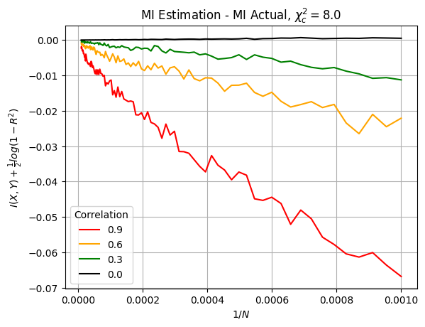
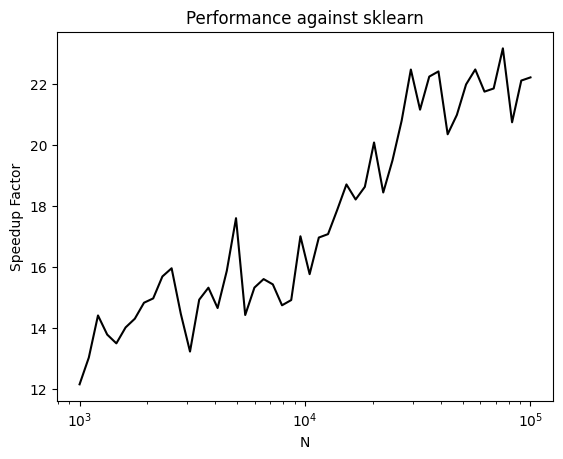

# Adaptive Partitioning Mututal Information (aminfo)

## Introduction

This package is an implementation of the adaptive partitioning mutual information algorithm [1]. This project is packaged for use in Python using Pybind11 and is written in standard C++. 

The adaptive partitioning algorithm is a single parameter estimator of the mutual information between two continuous variables. This package is untested on discrete (categorical data).

## Installation

The package is installed via `pip` in the traditional way.

```bash
pip install aminfo
```

## Usage

First, you should have two continuous variables `X` and `Y` that you seek to find the mutual information from. These variables should be `NaN` free.
```python
from aminfo import adaptive_mutual_information

X, Y = generate_some_data(...)

MI = adaptive_mutual_information(X, Y)
```

The function accepts a third positional argument that represents the only parameter used in this estimator, the critical Chi-squared value. This value is set to 8.0 by default.

```python
MI = adaptive_mutual_information(X, Y, 8.0)
```

## Background
### Adaptive Partitioning
The adaptive partitioning algorithm is an improvement on the "histogram" method of calculating mutual information. In this method, the bin sizes are driven by the information latent in distribution. The algorithm works by recursively partitioning the distribution in a fashion very similar to quadtree traversal. Each "child" is tested for distribution uniformity through a Chi-squared test:

$$
\chi^2 = \sum_{i=0}^{3} \frac{ \left( \left| n_i - e_i \right| - 0.5 \right)^2}{e_i}
$$

The child cell can split into grandchildren if the statistic exceeds some critical value:

$$
\chi^2 > \chi^2_c
$$

Typical values to try for `chi` are in the range of 4.0-8.0 for most distributions. A higher `chi` will make it harder to split each child and find more relationship between the variables, thereby having a tendency to underestimate the true MI. A lower `chi` will make it easier to split each child cell and may find more information than is really there, causing a tendency to overestimate the true MI. 

## Accuracy

I cannot speak to the "general" accuracy of the Adaptive Partitioning algorithm. I wrote this implementation in order to replace the use of `sklearn`'s estimator `mutual_information_regression` which is based on `scipy`'s KNN algorithm and is quite slow. Regardless, we can test the accuracy of the Adaptive partitioning esimator against a known analytical mutual information. For two standard normal gaussians that have some correlation $\rho$:

$$
X, Y = N(0, 1)
$$

$$
I(X, Y) = -\frac{1}{2}log(1-\rho^2)
$$

We can plot the difference between the estimator and the actual value for various correlations and number of datapoints, $N$.



As expected, the estimator's accuracy falls apart for low values of $N$ (right side of graph). But enjoys good performance at higher counts. Additionally, we can see that the estimator is more accurate for lower correlations across a wide range of $N$.

## Performance

I am a bit of a novice at C++, so this code could enjoy some further optimizations. In the following chart, I plot the performance speedup over `sklearn`'s `mutual_information_regression` which is based on a KNN estimator of the joint density. 



The baseline performance increase is around 10x for small datasets, and increases as high as 20x for datasets near 100k. This benchmark is performed for joint gaussian with correlation 0.9, and `n_neighbors=3` for the `mutual_info_regression` estimator.

## Further Work

Should time or necessity call for it, I may implement both a Parzen window approach to the joint density estimation, and the Copula entropy (no parameter estimator) algorithms for continuous mutual information. However, I will likely only do this if I find some issue during my work with the Adaptive Partitioning method.

## License

MIT License

## Acknowledgments

- [1] [Darbellay, Estimation of the information by an adaptive partitioning of the observation space](https://ieeexplore.ieee.org/document/761290)
- [2] [Assessing and Improving Classification and Prediction, Timothy Masters](http://www.timothymasters.info/my-technical-books.html)
- [3] Some inspiration from this implementation: [minfo](https://github.com/NeoNeuron/minfo)
